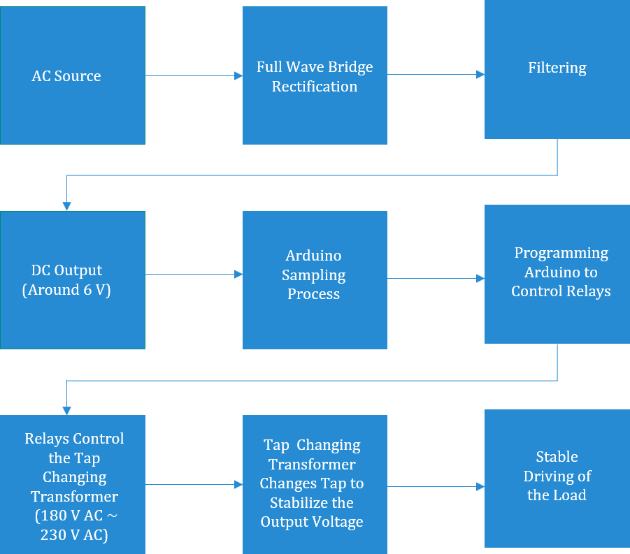
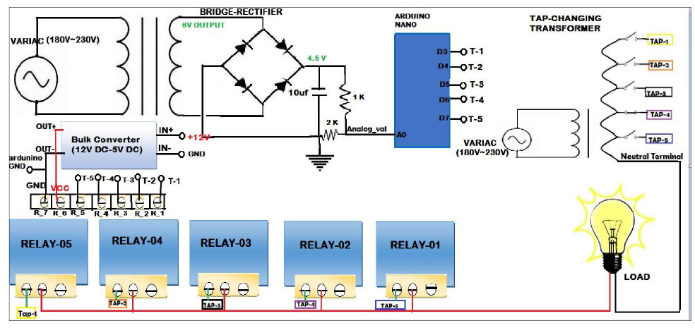
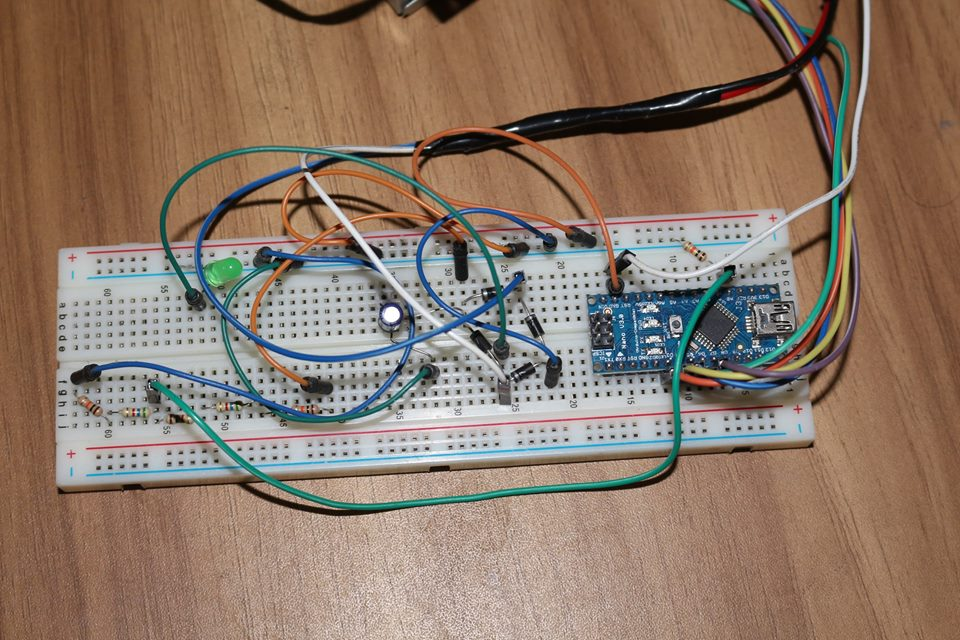
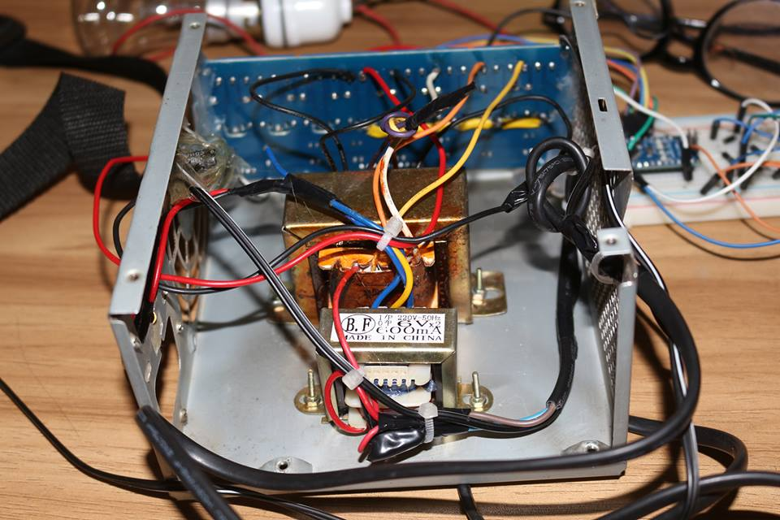
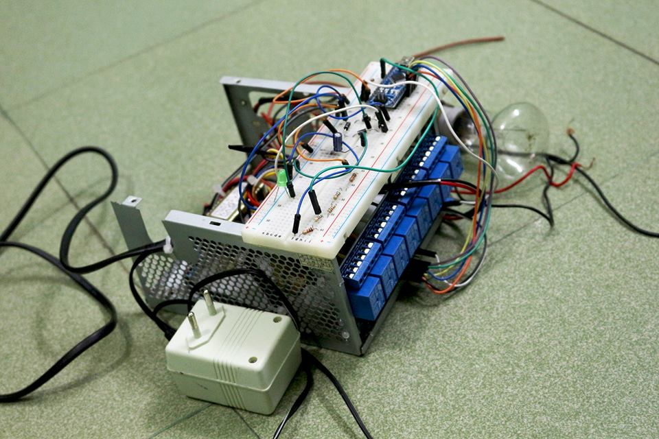

# Microcontroller Based Voltage Stabilizer
Voltage stabilizers are nowadays one of the most important requirements for all equipment. This project deals with alternative control techniques for load voltage stabilization. The technique of tap-changing transformer switched by a relay module in a coupled circuit is used. A microcontroller is used to control the switches to stabilize the load voltage against supply voltage and load current variation. Boosting or bucking effect is performed at low distortion to drive the relay module. The controlled stabilizer can reduce the supply voltage distortion and adjust the load voltage within a very short time. The technical report of this project is available at my [ResearchGate](https://www.researchgate.net/publication/318654258_Microcontroller_Based_Voltage_Stabilizer). The hardware testing video is available at my [Youtube](https://www.youtube.com/watch?v=p4Uw0DTCDqE&list=PLjNoIGauJyXgEuwqo5jd31XItulT7CI-5&index=5).

---

## Table of Contents
- [Getting Started](#getting-started)
- [Specifications of Components](#specifications-of-components)
- [Circuit Diagram](#circuit-diagram)
- [Electrical Testing Results](#electrical-testing-results)
   - [Arduino Sampling Values](#arduino-sampling-values)
   - [Tap Changing Transformer Output](#tap-changing-transformer-output)
     - [Tap-01](#tap-01) 
     - [Tap-02](#tap-02) 
     - [Tap-03](#tap-03) 
     - [Tap-04](#tap-04) 
     - [Tap-05](#tap-05) 
     - [Tap-06](#tap-06) 
     - [Tap-07](#tap-07) 
  - [Summary of Results](#summary-of-results)
- [Arduino Code](#arduino-code)
- [Prototype Images](#prototype-images)
   - [Voltage Sampling Circuit](#voltage-sampling-circuit)
   - [Wiring of the Transformer](#wiring-of-the-transformer)
   - [Wiring of the Relay Module](#wiring-of-the-relay-module)
   - [Final Prototype](#final-prototype)
- [Limitations of the Design](#limitations-of-the-design)
- [Assumptions of the Design](#assumptions-of-the-design)
- [Discussion](#discussion)

___
## Getting Started
This project analyses a different stabilizing topology and a different design based on tapping the relay for different supply voltages. The purpose is to achieve a nearly 220V value for each variation of supply to drive the load risk freely, thus stabilizing the output voltage. 

The **process chart** is as follows: 

---
## Specifications of Components
The required **components** are as follows:

| Serial No.| Components | Specifications | Quantity |
|:---------:|:----------:|:--------------:|:--------:|
|   1.      | Diode      | 1N4007         | 4 Unit |
|   2.      | Resistor   | 1KΩ , 2KΩ      | 1 Unit Each |
|   3.      | Capacitor  | 10 uf      | 1 Unit |
|   4.      | AC Supply (VARIAC)     | 180 V ~ 230 V (50 Hz)                            | 1 Unit |
|   5.      | Transformer            | i/p : 220 V (50 Hz) ,  o/p : 6*2 V (600 mA)        | 1 Unit |
|   6.      | Tap Changing Transformer            | i/p : 180 V - 230 V (50 Hz),  o/p : 220 V (2 A)        | 1 Unit |
|   7.      | Arduino Board            | Nano       | 1 Unit |
|   8.      | Bulk Converter          | i/p : 12 V (DC) , o/p : 5 V (DC)      | 1 Unit |
|   9.      | Relay Module          | 8 Relay Module (Operating Voltage: 5V DC)    | 1 Unit |
|   10.     | LED (Red)         | 1.8 V    | 1 Unit |
|   11.     | Bread Board        |     | 1 Unit |
|   12.     | Chords and wires       |     | |
|   13.     | Digital Multimeter       |     | 1 Unit |
|   14.     | Bulb (Load)        | 60 Watt, 210 ~ 240V (50 Hz)   | 1 Unit |
---

## Arduino Code
The compiled codes are as follows:

- [Voltage Sampling Code](https://github.com/sabrina-oshin/Microcontroller-Based-Voltage-Stabilizer/blob/main/voltage_sampling/voltage_sampling.ino)

- [Final Code](https://github.com/sabrina-oshin/Microcontroller-Based-Voltage-Stabilizer/blob/main/final_code/final_code.ino)

---

## Circuit Diagram

---
## Electrical Testing Results

### Arduino Sampling Values

| VARIAC Voltage (Volt) | Analog Value of Arduino | DC Output of A0 Pin (Volt) |
|:---------:|:----------:|:--------------:|
|   130     | 265-283    | 1.26           |
|   140     | 293-306    | 1.36           |
|   150     | 313-335    | 1.48           |
|   160     | 342-363    | 1.60           |
|   170     | 369-394    | 1.73           |
|   180     | 392-413    | 1.94           |
|   190     | 419-434    | 1.96          |
|   200     | 451-474 |    2.08          |
|   210     | 472-506 |    2.20            |
|   215     | 483-512 |    2.25           |
|   220     | 488-525 |    2.32            |
|   225     | 507-542 |     2.37          |
|   228     | 511-546 |    2.41           |
|   230     | 519-552 |   2.43          |

---
### Tap Changing Transformer Output

The output voltages of the tap changing transformer are as follows:

#### Tap-01

| VARIAC Voltage (Volt)  | Tap Changing Transformer Output (Volt) | 
|:---------:|:----------:|
|   150     | 157.4      |
|   160     | 167.1      |
|   170     | 177.7      |
|   180     | 188.3      |
|   190     | 198.9      |
|   200     | 209.0      |
|   210     | 219.8      |
|   215     | 224.3      |
|   220     | 230.2      |
|   225     | 234.9      |
|   228     | 238.2      |
|   230     | 240.4      |

---
#### Tap-02

| VARIAC Voltage (Volt)  | Tap Changing Transformer Output (Volt) | 
|:---------:|:----------:|
|   150     | 164.4      |
|   160     | 174.4      |
|   170     | 185.4      |
|   180     | 196.5      |
|   190     | 206.9      |
|   200     | 218.5      |
|   210     | 229.1      |
|   215     | 234.4      |
|   220     | 240.7      |
|   225     | 245.5      |
|   228     | 248.3      |
|   230     | 250.9      |

---
#### Tap-03

| VARIAC Voltage (Volt)  | Tap Changing Transformer Output (Volt) | 
|:---------:|:----------:|
|   150     | 170.4      |
|   160     | 182.3      |
|   170     | 192.4      |
|   180     | 204.4      |
|   190     | 216.1      |
|   200     | 227.3      |
|   210     | 238.7      |
|   215     | 243.9      |
|   220     | 250.1      |
|   225     | 255.8      |
|   228     | 259.4      |
|   230     | 261.1      |

---
#### Tap-04

| VARIAC Voltage (Volt)  | Tap Changing Transformer Output (Volt) | 
|:---------:|:----------:|
|   150     | 149.9      |
|   160     | 160.4      |
|   170     | 169.7      |
|   180     | 179.9      |
|   190     | 190.3      |
|   200     | 200.3      |
|   210     | 210.1      |
|   215     | 215.5      |
|   220     | 220.1      |
|   225     | 224.9      |
|   228     | 227.9      |
|   230     | 229.4      |

---
#### Tap-05

| VARIAC Voltage (Volt)  | Tap Changing Transformer Output (Volt) | 
|:---------:|:----------:|
|   150     | 143.3      |
|   160     | 152.3      |
|   170     | 162.6      |
|   180     | 172.2      |
|   190     | 181.8      |
|   200     | 190.3      |
|   210     | 200.1      |
|   215     | 205.5      |
|   220     | 210.7      |
|   225     | 214.3      |
|   228     | 217.6      |
|   230     | 219.4      |

---

#### Tap-06

| VARIAC Voltage (Volt)  | Tap Changing Transformer Output (Volt) | 
|:---------:|:----------:|
|   150     | 136.1      |
|   160     | 144.6      |
|   170     | 155.0     |
|   180     | 163.5      |
|   190     | 172.7      |
|   200     | 182.0     |
|   210     | 191.2      |
|   215     | 194.8      |
|   220     | 200.0     |
|   225     | 204.2      |
|   228     | 207.2      |
|   230     | 209.1     |

---

#### Tap-07

| VARIAC Voltage (Volt)  | Tap Changing Transformer Output (Volt) | 
|:---------:|:----------:|
|   150     | 129.1      |
|   160     | 138.2      |
|   170     | 146.7      |
|   180     | 155.3      |
|   190     | 163.8      |
|   200     | 173.8      |
|   210     | 180.6      |
|   215     | 185.3      |
|   220     | 190.2      |
|   225     | 194.4      |
|   228     | 196.2      |
|   230     | 198.2      |

---
### Summary of Results

| Input Voltage (Volt) | Output Voltage (Volt) | Tap-1 | Tap-2 | Tap-3 | Tap-4 | Tap-5 |
|:---------:|:----------:|:--------------:|:---------:|:----------:|:--------------:|:--------------:|
|   180     | 207.4      | OFF            |      OFF  | <ON style="color: green;">ON</ON>          | OFF            |        OFF     |
|   190     | 212.8      | OFF            |      OFF  | <ON style="color: green;">ON</ON>        | OFF            |        OFF     |
|   200     | 215.8      | OFF            |      <ON style="color: green;">ON</ON>    | OFF         | OFF               |        OFF     |
|   210     | 218.9      | <ON style="color: green;">ON</ON>         |      OFF  | OFF        | OFF             |        OFF     |
|   215     | 223      | OFF            |      OFF    | OFF         | <ON style="color: green;">ON</ON>              |        OFF     |
|   220     | 225      | OFF            |      OFF    | OFF        | OFF              |        <ON style="color: green;">ON</ON>      |
|   225     | 228      | OFF            |      OFF    | OFF        | OFF              |        <ON style="color: green;">ON</ON>      |
|   230     | 228      | OFF            |      OFF    | OFF        | OFF              |        <ON style="color: green;">ON</ON>      |

---

## Prototype Images
### Voltage Sampling Circuit

---
### Wiring of the Transformer

---
### Wiring of the Relay Module

---
### Final Prototype

---

## Discussion
Arduino detects the variation of the transformer's output voltage and then provides necessary instructions to the VARIAC. The relay changes the tap position if this variation is out of the permissible range. That's how the voltage of the system maintains its nominal value. The five tap settings (Tap 1, 2,3,4, and 5) of the tap changing transformer correspond to 210 V, 200 V, 190 V, 215 V, and 230 V, respectively. The input voltage to the transformer switches between 180 V to 230 V and the output remains 220V each time. The load current is 2A. At this condition, the tap settings will be ON for the respective taps having voltages similar to the input voltages (Tap 1 in ON when the voltage is 210 V when others remain OFF). The prototype reliability is tested by measuring the output voltage of the transformer when the input voltage increases steadily. Each time the tap changing transformer changes its tap changing settings, the output voltages are recorded. The recorded values are then compared with the target voltage 220 V to ensure the stable driving of the load. A more precise design of the tap changing transformer is required to regulate the power more efficiently.